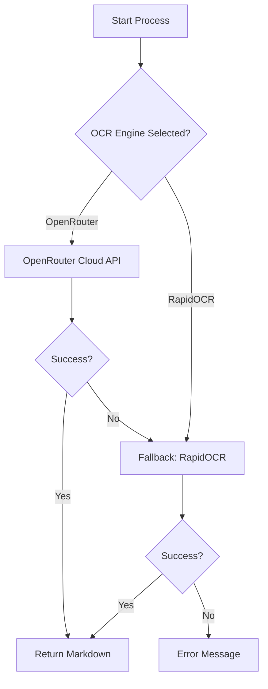

# Architecture Documentation - DocFlow

## 🏗️ System Overview

DocFlow is a multi-modal document extraction system designed to handle both digital and scanned documents with high precision. It uses a **Hybrid OCR Pipeline** that balances quality, cost, and localization.

### Core Components

1.  **Gradio UI (`app.py`)**: The entry point for users. Handles file uploads, setting configurations, and real-time feedback (cost estimation, quality scoring).
2.  **Structure Engine (`structure_engine.py`)**: The orchestration layer. It manages different extraction engines, routes requests, and integrates validation layers.
3.  **Layout Analyzer (`layout_analyzer.py`)**: Specialized module for document geometry. Handles column detection, XY-cut reading order, and semantic role classification.
4.  **Normalization (`cleaner.py`)**: Deterministic post-processor that standardizes Markdown formatting (lists, spacing, Unicode characters) and prevents code-block misinterpretation.
5.  **Validation Layers**:
    - **OpenRouter Validator (`openrouter_validator.py`)**: Validates LLM output for hallucinations, semantic annotations, and reading order.
    - **RapidOCR Validator (`rapidocr_validator.py`)**: Assesses local OCR quality, layout accuracy, and completeness.
6.  **Extraction Engines**:
    - **OpenRouter (Cloud)**: Uses Vision LLMs for high-accuracy OCR with RAG-optimized specialized prompts.
    - **pymupdf4llm (Local)**: **(NEW v2.1)** LLM-optimized Markdown extraction for digital PDFs with superior table handling and document structure preservation.
    - **RapidOCR (Local)**: High-speed local OCR engine with layout-aware post-processing for scanned documents.

---

## 🔄 Hybrid OCR Pipeline

The system intelligently routes extraction tasks through several layers to ensure the best possible result.

### 1. Routing Logic

When a file is processed, the system follows this priority path:



### 2. Layout & Validation Flow

Every extraction passes through a validation and layout analysis phase to ensure RAG-readiness.

```mermaid
graph TD
    A[OCR Output] --> B[Normalization (cleaner.py)]
    B --> C[Layout Analysis]
    C -- Column Detection --> D[Reading Order XY-Cut]
    D -- Noise Tagging --> E[Semantic Annotations]
    E --> F[Quality Validation]
    F -- Hallucination Check --> G[Final Markdown]
    F -- Score Calculation --> H[YAML Frontmatter]
    G --> I[Return Result]
    H --> I
```

### 3. Automatic Fallback Mechanism

- **API Failures**: If the OpenRouter API fails (e.g., timeout, rate limit, invalid key), the system automatically triggers local **RapidOCR** to ensure the user gets a result.
- **Unsupported Content**: If a digital PDF has non-extractable text, the system seamlessly transitions to OCR mode.

---

## 📊 Cloud OCR Strategy (OpenRouter)

DocFlow prioritizes **Cloud-First OCR** for precision while maintaining local fallback for reliability.

### Model Tiers

The system supports 5 model tiers to balance accuracy and cost:

1.  **FREE Tier**: `Nemotron Nano 12B VL` - High-quality OCR with zero cost. Default recommended option.
2.  **Cheap Tier**: `Gemini 2.0 Flash Lite` - Optimized for speed and low cost.
3.  **Balanced Tier**: `Qwen 2.5-VL 32B` - Excellent balance of layout understanding and price.
4.  **Quality Tier**: `Qwen 2.5-VL 72B` - High-accuracy model for complex documents.
5.  **Premium Tier**: `Mistral Pixtral Large` - SOTA vision model for the most demanding documents.

### Language Support

- **Global**: OpenRouter models support 100+ languages including **Myanmar**, Thai, Vietnamese, and Arabic.
- **Localized**: RapidOCR provides fast local processing for English, Chinese, Japanese, Korean, and Russian.

---

## 🔒 Data Flow & Privacy

- **Local Mode**: When using RapidOCR or Direct Extraction, all processing happens on the user's machine. No data leaves the local environment.
- **Cloud Mode**: When using OpenRouter, documents are converted to base64 images and sent securely to OpenRouter APIs. Documents are not stored by DocFlow and are subject to OpenRouter's privacy policy.

---

## 📊 RAG-Optimized Output

DocFlow is specifically designed for RAG (Retrieval-Augmented Generation) ingestion.

### Semantic Annotations

The system injects HTML comments to provide semantic context without breaking Markdown compatibility:

- `<!-- role:heading -->`: Identifies structural headings.
- `<!-- role:header -->` / `<!-- role:footer -->`: Identifies page-level noise (preserved for fidelity).
- `<!-- role:table -->`: Identifies tabular data.
- `<!-- page:N -->`: Explicit page markers for chunking.
- `<!-- reading-order:N -->`: Sequential order for multi-column layouts.

### Quality Validation Layer

A dedicated validation layer assesses every document:

- **Hallucination Detection**: Checks for common LLM failure patterns and placeholder text.
- **Data-Driven Completeness**: Uses PDF text layer metadata (if available) to verify OCR word counts against ground truth.
- **Completeness Check**: Estimates word count vs. page density (fallback) to flag missing content.
- **Confidence Markers**: Injects `<!-- confidence:X -->` markers for low-confidence OCR regions.

---

## 🛠️ Tech Stack

- **Frontend**: [Gradio](https://gradio.app/)
- **PDF Processing**: [PyMuPDF](https://pymupdf.readthedocs.io/), [MarkItDown](https://github.com/microsoft/markitdown)
- **Local OCR**: [RapidOCR](https://github.com/RapidAI/RapidOCR)
- **Layout Analysis**: Custom XY-cut and Gap-based clustering in `layout_analyzer.py`
- **Cloud API**: [OpenRouter](https://openrouter.ai/)
- **Language**: Python 3.10+
